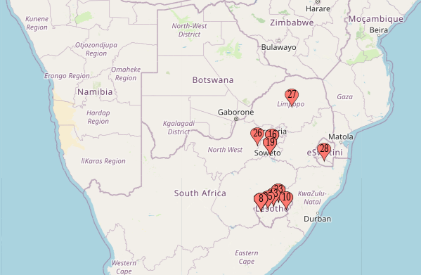

<html>
<head>
  <link rel="stylesheet" href="https://cdnjs.cloudflare.com/ajax/libs/font-awesome/4.7.0/css/font-awesome.min.css">
  <link rel="stylesheet" type="text/css" href="semantic/dist/semantic.min.css">
</head>

<!--   -------------------------------------------------------------------------------------------------------------------------------| -->
<!-- To update this table, it always shows top 2 last results.                                                                        | -->
<!-- To update it means copy last row in top table and make it top in the bottom table, then enter new top row in top table and so on.| -->
<!-- ---------------------------------------------------------------------------------------------------------------------------------| -->
<table style="width:100%">
  <tr>
   <th>GW EVENTS</th>
    <th>GW MUSIC</th>
    <th>MOTW</th>
    <th>POTW</th>
  </tr>
 <!-- -------------------------------Heading above----------------------------------- -->
  <tr>
    <td><a href = "#">GW3</a></td>
    <td><a href = "https://www.youtube.com/watch?v=2TL-ivF_JuE">Amapiano PS</a></td>
    <td><a href = "https://fantasy.premierleague.com/">NA</a></td>
   <td><a href = "https://en.wikipedia.org/">NA</a></td>
  </tr>
  <tr>
    <td><a href = "#">GW2</a></td>
    <td><a href = "https://www.youtube.com/watch?v=uuGiZWl13Zk">Maxim Lein</a></td>
    <td><a href = "https://fantasy.premierleague.com/entry/4673174/event/2">Swakll FC</a></td>
   <td><a href = "https://en.wikipedia.org/wiki/Son_Heung-min">Son</a></td>
  </tr>
 </table>
 <!-- ----------------------------------------------------------------------------------------------------------------------------| -->
 <!-- ----------------------------------------------This seperates the top and bottom tables--------------------------------------| -->
 <!-- ----------------------------------------------------------------------------------------------------------------------------| -->
 

   
Show all

    <table>
     <tr>
      <td><a href = "#">GW1</a></td>
      <td><a href = "https://www.youtube.com/watch?v=OVk0eQ0mu-M">Focused Melodies</a></td>
      <td><a href = "https://fantasy.premierleague.com/entry/2258467/event/1">NC Boys</a></td>
      <td><a href = "https://en.wikipedia.org/wiki/Son_Heung-min">Salah</a></td>
     </tr>
     </table>
  

<!-- --------------------------------------------------END OF TABLE---------------------------------------------------------------| -->
 

 <i class="fa fa-trophy" style="font-size:32px;color:yellow"></i> LEAGUES 

  

 TTFL is made up of, but not limited to the 3 leagues below as of 2020.
 
 <li><a href = "https://fantasy.premierleague.com/leagues/106494/standings/c" >TTFL classic</a></li>
 <li><a href = "https://fantasy.premierleague.com/leagues/153036/standings/h">TTFL HTH</a></li>
 <li><a href="https://fantasy.premierleague.com/leagues/153084/standings/h">TTFL championship HTH</a></li>

 

 
 <i class="fa fa-file-pdf-o" style="font-size:32px;color:red"></i> CONSTITUTION 

 
<h3>Membership</h3>

All TTFL teams are expected to be part of atmost 2 of the above league according to their eligibility.
Managers are also expected to join and participate in the league's whatsapp group to an acceptable level throughout the season.
Managers are mandated to manage their clubs throughout the season. Failure to manage the team for <b>5+ consecutive game weeks</b> will render the club <b>'a ghost'</b>, and such a club stands to face relegation at the end of the season.

Managing one's team is strictly defined as performing one of the following actions that can be proved:

<li>Player transfers</li>
<li>Captain and vice captain manual switching</li>
<li>Activating a chip or wildcard</li>
<li>shuffling the starting 11 and subs.</li>

All league codes will  be made available to qualified managers atleast a week before the first gameweek. Failure to join a league will lead to the next qualifying team in a lower league being given the spot 5 hours to GW1 Deadline.

<h3>Leagues</h3>

 
<li>Classic - all teams qualify to play classic and can join mid season</li>
<li>TTFL HTH - limited to exactly 20 top flight teams</li>
<li>Championship - all other teams not in TTFL HTH, but limited to 20 spots.</li>

At the end of a full season, the bottom 3 TTFL HTH teams are automatically relegated and the <b>top 3</b> in Championship gain automatic promotion to the top flight. <b>All relegation criteria applies before promotion.</b>

Relegation from Championship means the team will not play any HTH league the next season. The 3 spots will be filled by the highest 3 teams in classic not playing in any HTH league. Again <b>All relegation criteria applies before promotion.</b>

 

 
 <i class="fa fa-map-marker" style="font-size:32px;color:red"></i> TEAM HOMES 

 

 
TTFL is a football fantasy league based on the <a href="https://www.premierleague.com/">EPL</a> and runs in parallel with it throughout the season.

</html>

#### Live Bets(COMING IN GW 10)
[GW1](gw1.md) | [GW2](gw2.md) | [GW3](gw3.md) | [GW4](gw4.md) | [GW4](gw4.md) |
